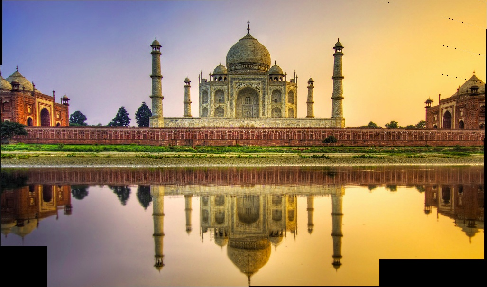

# Panorama Generator
We implement from a panorama generator from scratch.

## Example 1
### Original images:


### Panorama:


## Example 2
### Original images:


### Panorama:



## Example 3
### Original images:


### Panorama:


## Run
### Installation
```
pip install -r requirements.txt
```

### Run with sample images
```
cd src
python run.py
```

### Run with your own images
Clone and go inside `src` directory. Put all your images in folder `images` and run this.

```
import os,glob,cv2
from stitch import stitch_multiple_images_fast

img_mosaic = stitch_multiple_images_fast(*sorted(glob.glob("images/*")))
cv2.imwrite("result.jpg", img_mosaic)
```

## Theory
### How to stitch two images

Two images can be stitched if they are from the same camera center because they are related by a homography:

$$
x' = Hx
$$

where $x, x'$ are the image coordinates of a set of world points on two images from the same camera center (but different directions).

- Calculates homography matrix $H$ between scenes from same camera center using RANSAC through DLT technique. DLT uses SVD to find matrix with min error. RANSAC is a technique to repeatedly select few pairs of points randomly and run on those pairs instead of all. For derivation, refer [here](https://cseweb.ucsd.edu/classes/wi07/cse252a/homography_estimation/homography_estimation.pdf).
- Project one image on another. Essentially it means that for all coordinates on image, find the coordinates on the other image where it should lie on. Note that this may be outside the image size as well ie it need not necessarily be in $[(0,0),(w,h)]$ range.
- Stitching step: This is bit tricky. Here, we need to first find the resultant image size of the stitch. Then for both the images we put the image points at appropriate coordinates.
- Multiple images stitching: Two images that are to be stitched need to have some overlap to calculate homography. So, in this case, we first need to find the optial order of stitching using the number of SIFT point matches. Then we repeat the above steps.
- Post processing. In cases of low overlap, the resultant image often has grid like artefact. This can be partly solved using dilation.


